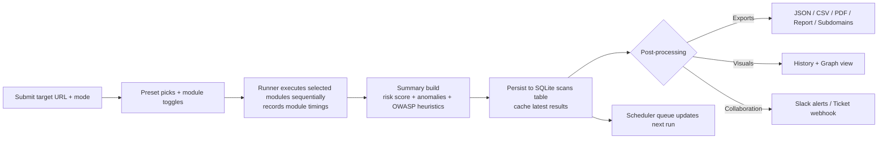

# AEGIS - Automated Enrichment & Global Intelligence Scanner

AEGIS (by sudo3rs) is a Windows-friendly single-file Flask app for rapid URL and domain reconnaissance. It stitches together passive OSINT, semi-offensive exposure checks, automation workflows, and reporting so blue/purple teams can move from "paste a URL" to "export evidence" in one pane.

> **Legal & Ethical Reminder**  
> Only scan assets you own or are explicitly authorized to test. Respect rate limits, terms of service, and local laws.

---

## Feature Highlights

- **Modular scanner** - 25+ modules covering crawling, headers, TLS, WHOIS/DNS, subdomains, CVEs, OSINT feeds, fuzzer payloads, JS secret hunting, OWASP Top 10 heuristics, and more.
- **Preset-powered UI** - Recon, Passive, and Semi-offensive presets pre-select modules, while checkboxes stay editable.
- **Deep customization** - Supply custom subdomain wordlists, exposure paths with severities, or Playwright-style workflow steps per run.
- **Risk scoring & anomalies** - `_summary` combines module output into a single risk score, risk level, and "what changed" deltas based on the last 10 runs.
- **Scheduling & automation** - Queue recurring scans, let the built-in scheduler execute them, and ship alerts to Slack or your ticketing webhook without extra infrastructure.
- **Ops-friendly outputs** - History view, `/view/<id>` permalinks, force-directed relationship graphs, PDF/CSV/JSON/subdomain exports, and a narrative `/export/report`.

---

## Flow of a Scan



---

## Example Use Case - Continuous Watch on a Crown-Jewel Domain

1. **Baseline** - Run a Passive preset scan on `https://acquired-saas.example`, enable TLS, DNS, subdomains, VT, urlscan, GitHub, Shodan, GreyNoise, and OWASP. Add a few company-specific subdomain words.
2. **Automate** - Set `schedule_minutes=60` so the same module mix runs hourly while the Flask app is up.
3. **Hunt** - Semi-offensive mode automatically triggers exposure checks, JS secret harvesting, the parameter fuzzer, and screenshots for each run (authorized targets only).
4. **React** - Slack gets alerted when `_summary.risk_score >= ALERT_THRESHOLD` (default 60). If the score crosses `AUTO_TICKET_THRESHOLD` (default 70) and high-severity exposures respond <400, an incident ticket webhook fires.
5. **Investigate changes** - History + `/graph/<id>` visualize new subdomains -> IPs, and `_summary.anomalies` reports when VT positives, missing headers, or risk jump 50% beyond the last 10 runs.

---

## Quick Start

```powershell
git clone <your-repo-url> AegisFusion
cd AegisFusion
python -m venv .venv
.venv\Scripts\Activate.ps1

# Base deps
pip install Flask requests beautifulsoup4 dnspython python-whois python-dotenv

# Enable optional modules as needed
pip install weasyprint pyppeteer playwright boto3
playwright install chromium  # required for the workflow runner
```

Create `.env` (see [Configuration](#configuration)) and then launch:

```powershell
python aegis_dev.py
# App listens on http://127.0.0.1:8080
```

> Binding to localhost avoids extra Windows firewall prompts. Run inside a terminal that can stay open while scheduled scans are active.

---

## Using the UI

1. **Enter URL + Mode** - Defensive mode sticks to passive modules, Semi-offensive forces exposure checks & JS secret hunting on top of selected modules.
2. **Choose a preset** - Recon, Passive, or Semi automatically select an opinionated module set. You can still tweak individual checkboxes.
3. **Toggle modules** - 27 checkboxes cover crawler, headers, TLS, DNS, WHOIS, subdomains, SecurityTrails, cloud assets (AWS S3 discovery), VirusTotal, urlscan, OTX, GitHub/code scan, Shodan, GreyNoise, AbuseIPDB, screenshots, sandbox, workflow runner, parameter fuzzer, HIBP, exposure checks, JS secrets, and OWASP Top 10.
4. **Custom inputs**  
   - **Subdomains** - One word per line (or comma-separated). Merged into the built-in brute-force list.
   - **Exposure paths** - Enter `/path` per line. Prefix with `high::`, `medium::`, or `low::` to pre-label severities (e.g., `high::/admin/.env`).
   - **Workflow steps** - JSON array of Playwright-style actions (`goto`, `click`, `type`, `wait`). Example:
     ```json
     [
       {"action":"goto","url":"https://target/login"},
       {"action":"type","selector":"#username","value":"test"},
       {"action":"click","selector":"button[type=submit]"},
       {"action":"wait","ms":1500}
     ]
     ```
5. **Schedule field** - Provide minutes (>0) to enqueue recurring scans. They run sequentially whenever the app receives requests (any route hit triggers the scheduler tick).
6. **View mode** - Render the HTML report or switch to JSON inline.

After each run you get:

- Summary tiles (risk score, VT positives, missing security headers, total duration).
- Module timings (`_meta.module_times`), expandable results per module, and OWASP Top 10 heuristics.
- Links to exports, `/view/<id>`, `/graph/<id>`, `/history`, `/scheduled`, and `/export/report`.

---

## Module Catalog (abridged)

| Module | What it does | Dependencies / Notes |
|--------|--------------|----------------------|
| `crawler` | Grabs HTML, outbound links, scripts, forms, and emails. | `requests`, `BeautifulSoup`. Feeds HIBP + graph view. |
| `headers` / `sec_headers` | Raw HTTP headers plus security header quality report. | Passive. |
| `tls` | TLS version, issuer, expiry. | Requires hostname to resolve. |
| `whois`, `dns`, `subdomains` | Domain metadata, DNS records, CT log search + optional brute force wordlist. | Uses `dnspython`, `crt.sh`. |
| `securitytrails` | Passive DNS via API. | `SECURITYTRAILS_API_KEY`. |
| `cloud_assets` | Lists AWS S3 buckets containing the domain keyword. | `boto3`, AWS credentials or default profile. |
| `signature_hits` | Regex signatures inside HTML (tech leakage, TODOs, access keys). | Extend `SIGNATURE_PATTERNS` in code. |
| `cve_alerts` | Looks up CVEs for detected stack entries. | Depends on `tech` output. |
| `virustotal`, `urlscan`, `otx`, `github`, `code_scan` | Third-party OSINT enrichment and lightweight static analysis of matching GitHub files. | API keys strongly recommended. |
| `shodan`, `greynoise`, `abuseipdb` | External host intel. | API keys. |
| `workflow` | Runs Playwright steps headless (Chromium) and captures HTML snapshot. | `playwright`, `WORKFLOW_MAX_STEPS` cap (default 15). |
| `screenshot` | pyppeteer screenshot encoded as data URI. | `pyppeteer`, `SCREENSHOT_TIMEOUT`. |
| `sandbox_report` | Ships captured HTML to your sandbox endpoint for detonation scoring. | `MALWARE_SANDBOX_URL`/`MALWARE_SANDBOX_KEY`. |
| `fuzzer` | Sends curated payloads via GET/POST and flags anomalous length/status combos. | Respect legal boundaries. |
| `exposure_checks` | HEAD requests to `/.git/config`, `/.env`, `/server-status`, etc., plus your custom paths. | Runs automatically in Semi mode. |
| `js_secrets` | Downloads referenced JS and searches for naive secret patterns (AKIA, Slack tokens). | Triggered automatically in Semi mode. |
| `hibp` | Cross-references emails scraped by the crawler. | `HIBP_API_KEY`. |
| `owasp_top10` | Maps module output to OWASP 2021 categories (pass/warn/fail). | Depends on exposures, TLS, security headers, fuzzer, etc. |

---

## Automation, Alerts, and Ops

- **Scheduler** - `scheduled_scans` table stores URL, module list, mode, custom extras, and intervals. Every request to the app calls `process_schedules()`, which runs one due job at a time (`app.config["_processing_schedule"]` prevents overlap). Keep a tab open or ping `/` periodically for hands-off monitoring.
- **Risk scoring** - `_summary` tallies missing security headers, VirusTotal verdicts, exposure hits, JS secrets, CVEs, OWASP findings, and HIBP breaches into a single integer. `risk_level` is low/medium/high at 0/30/60 thresholds.
- **Anomaly detection** - `compute_anomalies` compares the current summary against the last 10 scans of the same URL. Significant deltas (>=50% or >=1) bubble up to `_summary.anomalies`.
- **Slack notifications** - Set `SLACK_WEBHOOK_URL` and `ALERT_THRESHOLD` (default 60). Alerts include risk score, VT positives, missing headers, and optional change deltas.
- **Ticket webhook** - Set `TICKET_WEBHOOK_URL` and `AUTO_TICKET_THRESHOLD` (default 70). When triggered, high-severity exposures are attached to the payload for downstream systems (Jira, ServiceNow, etc.).
- **Report export** - `/export/report?format=pdf|html` produces an executive summary (OWASP table, exposures, fuzzer hits, top subdomains, signatures).
- **Relationship graph** - `/graph/<scan_id>` renders domain -> subdomain -> IP nodes, plus emails and external links, using the stored scan payload.

---

## Data & Exports

- **SQLite files** - `threat_hunter.db` (primary) right next to `aegis_dev.py` with two tables:  
  - `scans(id, url, results, scan_date)` stores the JSON blob for every run.  
  - `scheduled_scans(id, url, services, mode, extras, interval_minutes, next_run, last_run, last_results)` powers recurring jobs.
- **Routing quick reference**
  - `/` - New scan form.
  - `/scan` - Form POST + execution.
  - `/history` - Last 100 scans with links.
  - `/scheduled` - Active recurring jobs.
  - `/view/<id>` - Re-open a past scan (also refreshes export cache).
  - `/graph/<id>` - Relationship viz.
  - `/export/json`, `/export/csv`, `/export/subdomains.csv`, `/export/pdf`, `/export/report`.
- **Export tip** - Exports always use the cached "latest" result. To export an older scan, visit `/view/<id>` first, then hit the export endpoint.

---

## Configuration

Populate `.env` with the keys you have. The app degrades gracefully when a key is missing (module just reports the gap).

| Variable | Purpose |
|----------|---------|
| `VT_API_KEY` | VirusTotal URL lookups. |
| `OTX_API_KEY` | AlienVault OTX domain intel. |
| `GITHUB_TOKEN` | Raises rate limits for GitHub code search + static analysis. |
| `SHODAN_API_KEY` | Shodan host lookups. |
| `GREYNOISE_API_KEY` | GreyNoise actor classification. |
| `ABUSEIPDB_API_KEY` | AbuseIPDB reputation checks. |
| `SECURITYTRAILS_API_KEY` | Passive DNS enrichment. |
| `HIBP_API_KEY` | Have I Been Pwned email exposure checks. |
| `SLACK_WEBHOOK_URL`, `ALERT_THRESHOLD` | Risk-score-based alerting. |
| `TICKET_WEBHOOK_URL`, `AUTO_TICKET_THRESHOLD` | Auto-ticket creation. |
| `SCREENSHOT_TIMEOUT` | Seconds for the pyppeteer screenshot (default 20). |
| `AWS_REGION` | Region for AWS boto3 session (cloud assets module). |
| `MALWARE_SANDBOX_URL`, `MALWARE_SANDBOX_KEY` | Optional HTML submission to your sandbox. |
| `WORKFLOW_MAX_STEPS` | Guards workflow JSON length (default 15). |

Optional extras: `SLACK_WEBHOOK_URL`, `MALWARE_SANDBOX_*`, and ticket webhooks can stay blank; the corresponding actions simply skip.

---

## Working on AEGIS

AEGIS is intentionally a single Python file (`aegis_dev.py`) to make experimentation easy. A few tips for contributing or customizing:

### Add or extend a module

1. Implement a function that returns a dict/list describing output (`rows`, `error`, etc.).  
2. Register it inside `run_scan()` via `run_mod("module_key", condition, func, args...)`.  
3. Add the checkbox tuple in `INDEX_HTML` (for manual selection) and render logic inside `RESULTS_HTML` (or reuse existing block styles).  
4. Update presets or `_summary`/`owasp_top10` if the new module should influence scoring.  
5. Keep runtime small and wrap network calls with `DEFAULT_TIMEOUT` to avoid blocking the sequential runner.

### Customize the UI

`INDEX_HTML`, `RESULTS_HTML`, `HISTORY_HTML`, `SCHEDULED_HTML`, `GRAPH_HTML`, and `REPORT_HTML` live directly in the script as multiline strings. TailwindCSS (CDN) and Font Awesome handle styles/icons. Toggleable themes are implemented via a simple invert class-edit the JS snippet at the bottom of `INDEX_HTML` if you want a more advanced dark/light switch.

### Scheduler & storage notes

- Scheduler jobs run only when the Flask process is alive and receiving requests. For headless operation, keep a lightweight task (e.g., `curl http://127.0.0.1:8080/health`) hitting the app on an interval.
- Changing the DB schema? Update `init_db()` and consider a migration script; do **not** delete user data unless instructed.

### Testing changes

- Use short-lived targets (e.g., `https://example.com`) for smoke tests.  
- When touching modules that require API keys or optional libs, guard imports with try/except just like existing modules.  
- Run a scan, then inspect `threat_hunter.db` or the rendered HTML to confirm serialization works.

---

## Troubleshooting & Tips

- **WeasyPrint / PDF export fails** - Optional. If Windows dependencies are painful, skip `weasyprint` and rely on `/export/report?format=html`.
- **Playwright or pyppeteer missing** - Install the packages (plus `playwright install chromium`) to enable screenshots and workflow automation; otherwise those modules report `"error": "... not installed"`.
- **Scheduler "does nothing"** - It only triggers when a request hits the app. Keep a tab open or ping `/` periodically.
- **API rate limits** - Add API keys and watch console logs. Modules fail gracefully and the UI surfaces errors.
- **Corporate proxies** - Set standard `HTTP_PROXY`/`HTTPS_PROXY` env vars before launching the app.
- **Need raw JSON** - Choose "JSON" in the UI or hit `/export/json` directly.

Happy hunting-stay ethical, document findings, and iterate safely.


